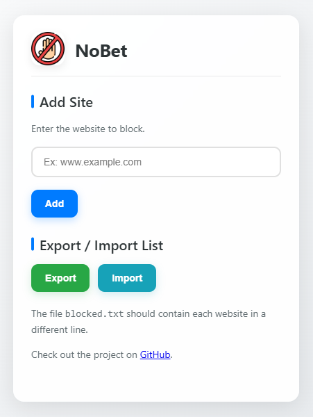

# NoBet - Website Blocker Extension

A minimalist and effective browser extension to block distracting websites, helping you stay focused and productive. Built with Manifest V3 for modern browsers.



## Features ✨

- **Block Websites Instantly 🚫**  
    Add sites to your blocklist with a single click

- **Smart Domain Parsing 🧠**  
    Handles URLs, subdomains, and top-level domains intelligently

- **Cross-Browser Ready ♻**  
    Compatible with Chrome, Edge, and other Chromium-based browsers

- **Data Portability 📑**  
    Export/Import your blocklist as a simple text file

- **Modern UI 🤖**  
    Clean, gradient-based interface with smooth animations

- **Open Source 📖**  
    MIT Licensed - free to use and modify


## Installation 🛠️

1. Clone the repository:
   ```bash
   git clone https://github.com/ThiagoRHorta/NoBet
   ```

2. Open Chrome/Edge and navigate to:
    ```bash
    chrome://extensions/
    ```

3. Enable Developer mode (top-right toggle)
4. Click Load unpacked and select the "extension" directory

## Usage 🖱️

1. **Click the extension icon**

2. **Add Sites:**  

    Enter domain (e.g., example.com or social.media)  
    Click "Add"

3. **Export/Import:**  

    **Export:** Generates blocked.txt with all blocked domains  
    **Import:** Load domains from properly formatted text file

## Development 🧑💻

### File Structure

    project-root/  
        ├── extension/  
            ├── background.js   - Core blocking logic  
            ├── manifest.json   - Extension configuration  
            ├── options.html    - Popup interface  
            ├── options.js      - UI functionality  
            ├── styles.css      - Modern styling  
            ├── icons/          - Extension assets  
                └── icon16.png, icon32.png, icon64.png, icon128.png

### Contributing

1. **Fork the repository**

2. **Create your feature branch:**
    ```bash
    git checkout -b feature/amazing-feature
    ```

3. **Commit changes:**
    ```bash
    git commit -m 'Add amazing feature'
    ```
4. **Push to branch:**
    ```bash
    git push origin feature/amazing-feature
    ```

5. **Open a Pull Request**